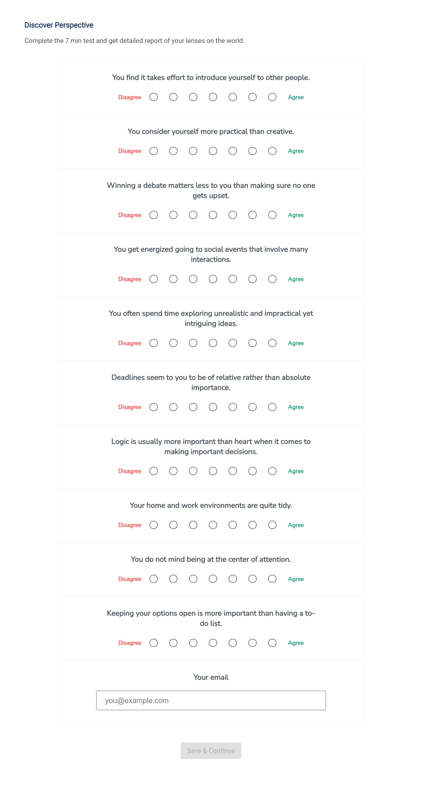

# MbtiUi

This project was generated with [Angular CLI](https://github.com/angular/angular-cli) version 10.1.1.

## Demo site

[https://sulha199.github.io/mbti-ui/master](https://sulha199.github.io/mbti-ui/master)

Because of the php hosting limitation on handling the POST request, the app will not be able to submit the survey into backend.

You are able to run app in full stack using docker by cloning this repo [https://github.com/sulha199/mbti-docker](https://github.com/sulha199/mbti-docker).

The other way is by [running the UI](##running-ui-apps) and API ([https://github.com/sulha199/mbti-api](https://github.com/sulha199/mbti-api)) separately by yourself.

## Running UI apps

Run `ng serve` for a dev server. Navigate to `http://localhost:4200/`. The app will automatically reload if you change any of the source files.

## Code scaffolding

Run `ng generate component component-name` to generate a new component. You can also use `ng generate directive|pipe|service|class|guard|interface|enum|module`.

## Build

Run `ng build` to build the project. The build artifacts will be stored in the `dist/` directory. Use the `--prod` flag for a production build.

## Running unit tests

Run `ng test` to execute the unit tests via [Karma](https://karma-runner.github.io).

## Running end-to-end tests

Run `ng e2e` to execute the end-to-end tests via [Protractor](http://www.protractortest.org/).

## Further help

To get more help on the Angular CLI use `ng help` or go check out the [Angular CLI README](https://github.com/angular/angular-cli/blob/master/README.md).

## Preview Image

